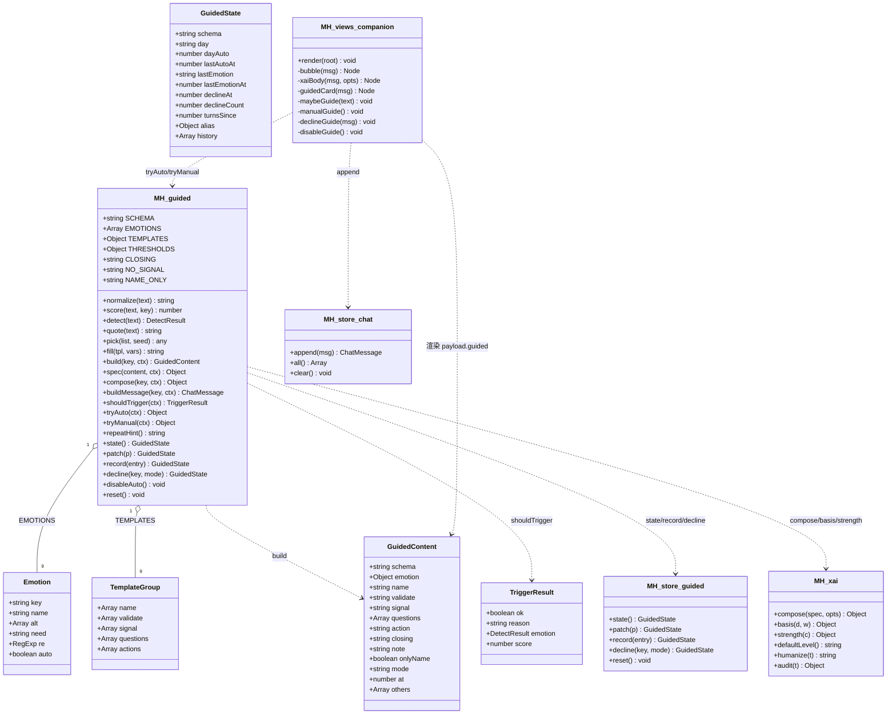
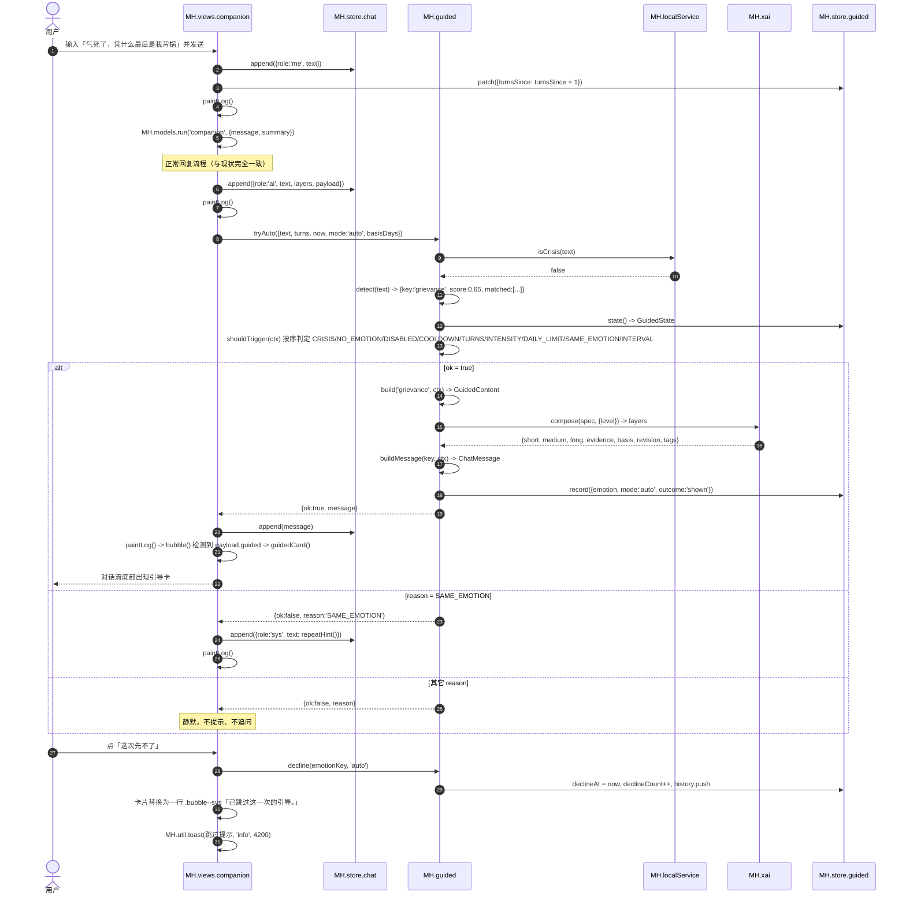
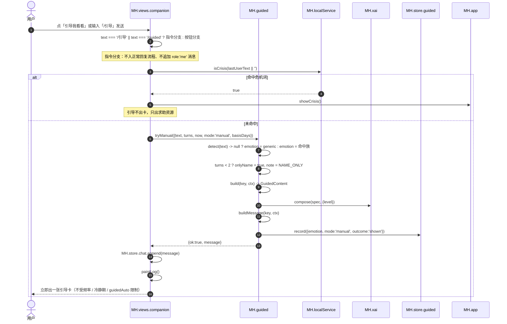
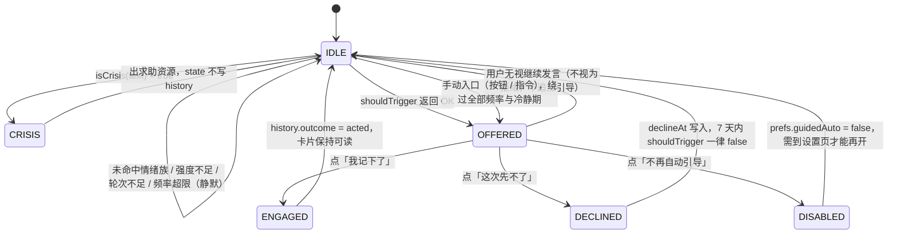
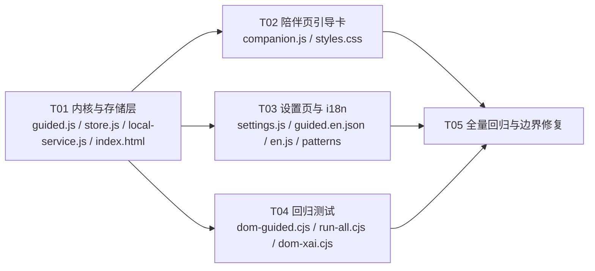

# 「AI 引导式学习（Guided Learning）」系统设计与任务分解

> 架构师：高见远（Gao）
> 需求源：`docs/guided-learning-spec.md`（PRD）
> 技术底座：MoodHub Web —— 零构建 / 零运行时依赖 / 原生 ES5 风格 JS / 全局命名空间 `window.MH` / 只写本机 localStorage
> 本文档面向工程师：函数名、字段名、返回值、正则、模板原文、任务顺序均已写死，可直接落笔。
>
> **v2（评审后修订）**：PM 已确认 Q1 / Q3 / Q5 / Q7，并补充三条口径（Q11 禁止跨档重复计分、Q12 长档推理边界的渲染出口、Q13 tag 文案）。PRD `docs/guided-learning-spec.md` 已同步修订。改动集中在 §3.4（`xaiBody` 新增 `basisTail` / `basisOpenOn`）、§4.4（正则与重复计分硬规则）、§4.6（边界渲染）、§4.3/§3.3（tag 文案）、§9（+2 条用例）、§10（Q11–Q13）。
>
> **v3（二次评审后修订）**：PM 补充两条冷静期口径——**Q14「绕过」≠「清除」**（冷静期内手动出卡不清除 `declineAt`，唯一例外是设置页把自动引导重新打开）、**Q15 冷静期内不加任何提示**（静默开始，静默结束）。改动集中在新增 §4.8、§3.1（新增 `enableAuto()` 与 `inCooldown()`）、T02/T03 实现约束、§9 E 组（+2 条用例）、§10（Q14–Q15）、§11（+2 条自检）。

---

## 0. 已拍板决策与落地方式（先对齐，避免返工）

| # | 决策 | 落地到代码的方式 |
| --- | --- | --- |
| D1 | 引导卡 = **独立一条 AI 消息**，追加在正常回复之后 | `MH.guided.buildMessage()` 返回完整消息对象，`MH.store.chat.append(msg)`；`payload.guided` 承载结构化内容；`bubble()` 按 `msg.payload && msg.payload.guided` 分支到 `guidedCard()` |
| D2 | 自动触发默认开（`prefs.guidedAuto = true`），**不做首次进入的系统提示** | `DEFAULT_PREFS` 加 `guidedAuto: true`；不在 `companion.render()` 里追加任何介绍性 `sys` 气泡 |
| D3 | 正文**只用本地模板**，不接云端 | `js/core/guided.js` 内禁止出现 `fetch` / `XMLHttpRequest` / `MH.models.run`；`P1` 的 `MH.guided.prompt()` 本次**不实现**（不写空函数，避免误以为已支持） |
| D4 | 频率数值按 PRD 建议 | 见 §4.3 `THRESHOLDS` 常量表，全部集中在 `js/core/guided.js` 顶部，禁止散落在视图里 |
| D5 | 写回记录不做（P2） | 本次不碰 `js/views/records.js`、`MH.store.records` |
| D6 | `INTENTS` 顺序坑 | `grievance` 插在 `moodLow` **之前**，`excitement` 插在 `good` **之前**；同时必须补 `REPLIES.grievance` / `REPLIES.excitement`，否则新意图会落到 `fallback` |
| D7 | 引导卡复用 `xaiBody` | 不改 UI 结构、不新造解释组件；`xaiBody(msg, opts)` 增加 7 个可选参数（见 §3.4） |

---

## 1. 实现方案与选型说明

### 1.1 为什么核心逻辑独立成 `js/core/guided.js`（DOM 无关）

1. **可测试**：`tests/dom-guided.cjs` 与 `tools/check-miniprogram-kernel.cjs` 都是无 DOM 环境。识别 / 评分 / 触发判定 / 内容生成全部是纯函数，能在 node 里直接 `require` 后断言，不需要 DOM 桩。
2. **可复用**：PRD P2-3 要求把这份逻辑抽给小程序 / 桌面端。`guided.js` 与 `xai.js` 同等约束：不引用 `document` / `window.localStorage` / `MH.util.toast`，只依赖 `MH.xai`（同为内核）与调用方注入的 `ctx`。
3. **可隔离风险**：引导是"主动开口"的功能，最容易引发打扰投诉。把"要不要开口"收敛成一个纯函数 `shouldTrigger(ctx)`，产品口径的任何调整只改一个文件，不动视图。
4. **无网络出口可被静态检查**：文件里搜不到 `fetch` / `XMLHttpRequest` / `MH.models`，隐私承诺可被 code review 直接验证。

> 硬约束：`js/core/guided.js` 内**只允许** `require`/引用 `MH.xai` 与 `MH.util.clamp`；`MH.store` 只允许在 `state()` / `patch()` / `record()` / `decline()` / `disableAuto()` / `reset()` 这 6 个副作用函数里出现，且必须 `try/catch` 包裹（store 可能未初始化）。

### 1.2 为什么引导卡复用 `xaiBody` 而不新造解释 UI

- `xaiBody` 已经把「三档切换 + 依据披露 + 请求校正 + 符合/部分符合/不符合」这一整套**可纠正闭环**实现好了。引导内容同样是"关于这个人的一版读法"，同样必须可纠正；新造一套 UI 等于把这条承诺复制一份，还容易走样。
- 复用后，引导卡的反馈自动写入 `MH.store.xai`，`MH.xai.revisionNote()` 会自动承认上一版被推翻，与正常回复共享同一份反馈库——这正是 PRD「可解释、可纠正」想要的效果。
- 代价是 `xaiBody` 需要 7 个可选参数（§3.4），改动量约 25 行，远小于新造组件的收益损失。

### 1.3 为什么状态存 store 而不是内存

- PRD P0-5 明确要求「跨刷新生效」「防止靠清空对话绕过频率限制」。内存态在刷新后归零，冷静期与每日上限会失效，用户会被反复打扰。
- `MH.store` 已有 `usable` 探测与 `memory` 降级容器，`storageAvailable === false` 时功能不中断、只把每日上限降为 1，正是 PRD §8.5 要的行为。
- 放 store 才能随 `exportAll/importAll` 迁移、随 `wipeEverything` 清空，不留下"看不见的暗数据"。

---

## 2. 完整文件清单

根目录统一为 `D:/Downloads/MoodHub-main/MoodHub-main/moodhub-web/`，下表路径均相对该目录。

| # | 文件 | 新增/修改 | 职责 | 预估改动量 |
| --- | --- | --- | --- | --- |
| 1 | `js/core/guided.js` | **新增** | 情绪族表 `EMOTIONS`、模板 `TEMPLATES`、阈值 `THRESHOLDS`、`detect/score/quote/fill/pick/build/spec/compose/buildMessage/shouldTrigger/tryAuto/tryManual/repeatHint` 纯函数，`state/patch/record/decline/disableAuto/reset` 副作用函数。DOM 无关、无网络出口 | **+420 行**（含模板文案） |
| 2 | `js/core/store.js` | 修改 | `K.guided` 键；`DEFAULT_PREFS.guidedAuto`；`MH.store.guided` 命名空间（`state/patch/record/decline/reset`）；`exportAll` 加 `guided`；`importAll` 还原 `guided`；`storageUsage` 键清单加 `K.guided` | **+70 行 / 5 处** |
| 3 | `js/core/local-service.js` | 修改 | `INTENTS` 插入 `grievance`（`moodLow` 前）与 `excitement`（`good` 前）；新增 `REPLIES.grievance` / `REPLIES.excitement` | **+55 行 / 3 处** |
| 4 | `js/views/companion.js` | 修改 | `xaiBody` 加 `opts`；新增 `guidedCard/glBlock/glHead/glFoot`；`bubble()` 分支；`submit()` 后 `maybeGuide()`；`/引导` 指令；`#cmpGuide` 按钮；退出绑定；清空对话时 `turnsSince` 归零 | **+180 行 / 8 处** |
| 5 | `js/views/settings.js` | 修改 | 「数据与外观」区新增一行 `setting-row` 开关（`#setGuidedAuto`），写 `prefs.guidedAuto` | **+18 行 / 2 处** |
| 6 | `css/styles.css` | 修改 | `.gl*` 系列样式；`[data-emotion]` 色条映射；620 / 860px 断点 | **+95 行 / 1 段**（追加在 `.xai__note` 之后） |
| 7 | `index.html` | 修改 | 在 `js/core/xai.js` 之后、`js/core/local-service.js` 之前注册 `js/core/guided.js` | **+1 行** |
| 8 | `i18n/parts/guided.en.json` | **新增** | 引导模块全部中英词条 | **+70~90 条** |
| 9 | `i18n/en.js` | 生成物 | `node tools/i18n-build.cjs` 自动重建，**禁止手改** | 自动生成 |
| 10 | `tools/i18n-patterns.cjs` | 修改（可能） | 若采用 §4.6 的两条拼接句，追加 2 条 `patterns`（已锚定 `^…$`） | **+2 条** |
| 11 | `tests/dom-guided.cjs` | **新增** | 引导模块 DOM 级回归套件（约 34 条断言） | **+260 行** |
| 12 | `tests/run-all.cjs` | 修改 | `SUITES` 数组登记 `dom-guided.cjs` | **+1 行** |
| 13 | `tests/dom-xai.cjs` | 修改 | require 列表补 `'guided.js'`（放在 `'xai.js'` 之后） | **+1 行** |
| 14 | `docs/guided-learning-design.md` | 新增 | 本文档 | — |
| 15 | `docs/guided-sequence-diagram.mermaid` | 新增 | 时序图源文件（与 §5 同步） | — |
| 16 | `docs/guided-class-diagram.mermaid` | 新增 | 类图源文件（与 §3 同步） | — |

---

## 3. 接口设计

### 3.1 `MH.guided` 完整公开 API

> 标记：**[纯]** = 不读 store、不写 store、不碰 DOM、不产生随机数（同输入必同输出）；**[副作用]** = 会读写 `MH.store`。

#### 常量

| 名称 | 类型 | 值 / 说明 |
| --- | --- | --- |
| `MH.guided.SCHEMA` | string | `'moodhub.guided/v1'` |
| `MH.guided.EMOTIONS` | Array | 情绪族表，见 §4.1（含 `generic`，`generic.auto === false`） |
| `MH.guided.TEMPLATES` | Object | 模板表，见 §4.2 |
| `MH.guided.THRESHOLDS` | Object | 见 §4.3 |
| `MH.guided.CLOSING` | string | 温和收尾（全局唯一，不按族分） |
| `MH.guided.NO_SIGNAL` | string | 无情绪命中时的手动开启提示 |
| `MH.guided.NAME_ONLY` | string | 轮次不足时的手动开启降级说明 |

#### 纯函数

| 签名 | 入参 | 返回 | 说明 |
| --- | --- | --- | --- |
| `normalize(text)` **[纯]** | `string` | `string` | `String(text\|\|'').trim().slice(0, 1000)` |
| `score(text, emotionKey)` **[纯]** | 文本、族 key | `number` | 0 ~ 1，见 §4.4；未命中返回 `0` |
| `detect(text)` **[纯]** | `string` | `null` 或 `DetectResult` | 见下方结构；危机词由 `shouldTrigger` 前置拦截，`detect` **不判危机** |
| `quote(text)` **[纯]** | `string` | `string` | ≤12 字片段（P0 不使用，保留给 P1；见 §10-Q3） |
| `pick(list, seed)` **[纯]** | 数组、字符串种子 | `any` | `list[hash(seed) % list.length]`，`hash` 为 32 位字符串散列。**不用 `Math.random()`**，保证测试可复现；`list` 为空返回 `''` |
| `fill(tpl, vars)` **[纯]** | 模板串、变量对象 | `string` | 替换 `{{name}} {{alt}} {{need}} {{quote}} {{action}}`；未提供的键替换为空串；结果再过一次 `String(x\|\|'')` |
| `build(emotionKey, ctx)` **[纯]** | 族 key、`ctx` | `GuidedContent` | 见 §4.5；未知 key 自动回落 `generic` |
| `spec(content, ctx)` **[纯]** | `GuidedContent`、`ctx` | xai spec | `{short, medium, long, evidence, basis, tags, revision}` |
| `compose(emotionKey, ctx)` **[纯]** | 族 key、`ctx` | xai 对象 | `MH.xai.compose(spec(build(...), ctx), {level})` 的返回 |
| `buildMessage(emotionKey, ctx)` **[纯]** | 族 key、`ctx` | `ChatMessage` | 可直接交给 `MH.store.chat.append()`，见 §4.7 |
| `shouldTrigger(ctx)` **[纯]** | `ctx` | `TriggerResult` | 见下方；`ctx.state` 缺省时才读 store |
| `repeatHint()` **[纯]** | — | `string` | PRD §8.8 的固定提示句 |
| `inCooldown(now, state)` **[纯]** | 时间戳、state | `boolean` | `!!(state && state.declineAt && now - state.declineAt < THRESHOLDS.COOLDOWN_MS)`。视图判断冷静期**一律调它**，禁止在视图里另写 `now - declineAt < 7 天` |

**`DetectResult`**
```js
{
  key: 'anger',                 // 族 key
  name: '愤怒',                  // 族名
  alt: ['生气', '窝火', '火大'],  // 别名（P1 用）
  need: '被提前告知',             // 该族指向的需要
  score: 0.75,                  // 0 ~ 1
  matched: ['气死', '窝火'],      // 命中的词（≤6 个，供依据区展示）
  all: [/* 全部命中族，按 score 降序、同分按 EMOTIONS 顺序 */],
  auto: true                    // 该族是否允许自动触发（generic 为 false）
}
```

**`TriggerResult`**
```js
{ ok: true,  reason: 'OK',          emotion: DetectResult, score: 0.75 }
{ ok: false, reason: 'CRISIS',      emotion: DetectResult, score: 0.9  }
{ ok: false, reason: 'NO_EMOTION',  emotion: null,         score: 0    }
{ ok: false, reason: 'DISABLED' | 'COOLDOWN' | 'TURNS' | 'INTENSITY'
             | 'DAILY_LIMIT' | 'SAME_EMOTION' | 'INTERVAL', emotion: DetectResult, score: 0.x }
```

**`ctx`（统一上下文对象，所有函数共用）**
```js
{
  text: '气死了，凭什么最后是我背锅', // 用户刚说的这句话（必填）
  turns: 3,                          // 本次会话内用户发言轮次（含刚发出的这句）
  now: 1748000000000,                // 测试可注入；缺省 Date.now()
  mode: 'auto' | 'manual',           // 缺省 'auto'
  state: null,                       // 缺省 → MH.store.guided.state()；测试直接注入对象即可完全脱库
  auto: true,                        // 等价于 mode === 'auto'，显式传入优先
  basisDays: 0,                      // 最近 14 天有记录的天数；缺省 0
  level: 'medium',                   // xai 档位；缺省 MH.xai.defaultLevel()
  emotion: null,                     // 已算好的 DetectResult；缺省 detect(text)
  others: []                         // build 用：次高族数组（由 detect().all.slice(1) 提供）
}
```

#### 副作用函数

| 签名 | 行为 |
| --- | --- |
| `state()` | `MH.store.guided.state()` 的同名转发；store 缺失时返回内存默认态，**不抛错** |
| `patch(p)` | 合并写回并返回新 state |
| `record(entry)` | `entry = {emotion, mode:'auto'\|'manual', outcome:'shown'\|'acted'\|'rejected', at?}` → 更新 `day/dayAuto/lastAutoAt/lastEmotion/lastEmotionAt`（`turnsSince` 归 0）、`history.push`（上限 30）。**只有 `mode==='auto' && outcome==='shown'` 才 `dayAuto++`** |
| `decline(emotionKey, mode)` | `declineAt = now`、`declineCount++`、history 追加 `{emotion, mode, outcome:'declined'}` |
| `disableAuto()` | `MH.store.prefs.set({ guidedAuto: false })`；store 缺失时静默 |
| `enableAuto()` | `MH.store.prefs.set({ guidedAuto: true })` **并** `patch({ declineAt: 0, declineCount: 0 })`。**只有这个函数清冷静期**（唯一的显式重开入口，见 §4.8） |
| `reset()` | 清空 `moodhub.v1.guided`（测试与「重置引导状态」用） |

#### 编排函数（视图只调这两个）

| 签名 | 返回 | 行为 |
| --- | --- | --- |
| `tryAuto(ctx)` | `{ok, reason, message, emotion}` | `shouldTrigger(ctx)` → 命中则 `buildMessage` + `record({mode:'auto', outcome:'shown'})`。`ok:false` 时 `message` 为 `null` |
| `tryManual(ctx)` | `{ok, reason, message, emotion}` | 危机 → `{ok:false, reason:'CRISIS'}`；未命中 → 用 `generic`；`turns < 2` → `onlyName`；最后 `record({mode:'manual', outcome:'shown'})`。**只绕过冷静期，绝不清除 `declineAt`**（§4.8，这是最容易写反的一行） |

> `tryAuto` / `tryManual` 都不碰 DOM、都不调 `MH.util.toast`；提示语由视图负责，保证内核可被小程序复用。

### 3.2 `MH.store.guided` API

| 签名 | 返回 | 说明 |
| --- | --- | --- |
| `state()` | `GuidedState` | 读 `K.guided` → 校验 `schema` → **自然日滚动**（`day !== todayISO()` 则 `dayAuto = 0; day = todayISO()`）→ 补齐缺失字段 → 返回。任何异常返回 `DEFAULT_STATE` |
| `patch(p)` | `GuidedState` | `Object.assign(state(), p)` 后 `writeJSON(K.guided, next)`，返回 next |
| `record(entry)` | `GuidedState` | 见 §3.1（store 层只做计数与裁剪，不做判定） |
| `decline(emotionKey, mode)` | `GuidedState` | 见 §3.1 |
| `reset()` | `undefined` | `lsRemove(K.guided)` |

键名：`K.guided = NS + 'guided'`（即 `moodhub.v1.guided`）。

### 3.3 chat 引导消息完整结构

```js
MH.store.chat.append({
  role: 'ai',
  text: layers.text,                       // = MH.xai.flatten(layers, level)
  tags: ['引导式学习', '愤怒', '自动出现'],  // mode==='manual' 时第三项为 '手动开启'
  layers: {                                // MH.xai.compose 的返回
    schema: 'moodhub.xai/v1',
    short: '…', medium: '…', long: '…',
    level: 'medium',
    evidence: ['这一句话里读到的线索：气死、窝火'],
    basis: { days: 0, windowDays: 14, confidence: 'none', text: '依据：…' },
    revision: '这些只是基于你这句话的一版读法，不是给你的定性。哪一句不准，你说一句，我就改写它。',
    tags: ['引导式学习', '愤怒', '自动出现']
  },
  payload: {
    guided: {
      schema: 'moodhub.guided/v1',
      emotion: { key: 'anger', name: '愤怒', alt: ['生气', '窝火', '火大'], need: '被提前告知' },
      name: '听起来，这更像是一股愤怒。你觉得准吗？叫它别的也行。',
      validate: '不是你脾气差，是有什么东西顶到你了。',
      signal: '愤怒常常是在说有一条边界被越过了。这一次，被越过的可能是「被提前告知」那条线。',
      questions: [
        '如果把它翻译成一句「我需要……」，会是哪一个词？',
        '这件事里，真正被碰到的那条线是什么？'
      ],
      action: '先给身体一个出口：把想说的话写下来，先不发。等心率降下来再决定要不要表达。',
      closing: '这些只是基于你这句话的一版读法，不是给你的定性。哪一句不准，你说一句，我就改写它。',
      note: '',            // 降级说明（轮次不足时为「信息还不多，这一步我只做命名，不做解读。」）
      onlyName: false,     // true 时 signal / questions / action 均为空
      mode: 'auto',        // 'auto' | 'manual'
      at: 1748000000000,
      others: []           // 次高族的 {key, name}（用于「可能夹着委屈」后缀）
    },
    model: { id: 'local-guided', name: '本地模板', privacy: 'on-device', degraded: false }
  }
});
```

落库裁剪约定（防止 localStorage 膨胀）：`questions` 最多 4 条、每条 200 字；`name/validate/signal/action/closing` 各 400 字；`others` 最多 2 项；`payload.guided` **不含** `quote` 与用户原话（见 §10-Q3）。

### 3.4 `bubble()` / `guidedCard()` 渲染约定

```js
function bubble(msg) {
  var cls = msg.role === 'me' ? 'bubble--me' : (msg.role === 'sys' ? 'bubble--sys' : 'bubble--ai');
  var node = el('div', { class: 'bubble ' + cls });

  if (msg.role === 'ai' && msg.payload && msg.payload.guided) node.appendChild(guidedCard(msg));
  else if (msg.role === 'ai' && msg.layers) node.appendChild(xaiBody(msg));
  else node.appendChild(el('span', { text: msg.text }));

  if (msg.tags && msg.tags.length) { /* 保持原样 */ }
  if (msg.role !== 'sys') node.appendChild(el('span', { class: 'bubble__time', text: U.fmtDateTime(msg.at) }));
  return node;
}
```

`xaiBody(msg, opts)` 新增 7 个可选参数（**默认值与现状完全等价，现有调用点零影响**）：

| 参数 | 类型 | 默认 | 作用 |
| --- | --- | --- | --- |
| `opts.body` | boolean | `true` | `false` 时不渲染 `.xai__body` 文本区（引导卡用结构化区块代替） |
| `opts.blocks` | Array\<Node\> | `[]` | 插入到三档开关之后、`.xai__ask` 之前的节点数组 |
| `opts.ask` | string | `shortAsk(levelFor(msg))` | 覆盖请求校正文案（引导卡传 `content.closing`） |
| `opts.onLevel` | function | `null` | 档位切换后回调 `(lv)`，引导卡用它同步区块展开态 |
| `opts.cls` | string | `''` | 追加到 `.xai` 的 class（引导卡传 `'gl__xai'`） |
| `opts.basisTail` | function | `null` | `(lv) => string`，追加到 `.xai__basis-body` 尾部（引导卡在 `long` 档返回推理边界句） |
| `opts.basisOpenOn` | function | `null` | `(lv) => boolean`，控制 `<details class="xai__basis">` 的 `open`（引导卡在 `long` 档返回 `true`） |

> `basisTail` / `basisOpenOn` 的引入理由见 §4.6「推理边界的渲染出口」。两者都只在引导卡传入，普通 AI 回复的行为与今天完全一致（依据区默认收起、无尾句）。

`guidedCard(msg)` 的 DOM 骨架（顺序即键盘顺序）：

```
div.gl [role=group][aria-live=polite][aria-label='情绪引导 · ' + name][data-emotion=key]
├── div.gl__head
│   ├── span.gl__badge            「情绪引导」
│   ├── span.gl__chip             emotion.name
│   └── button.gl__close          「这次先不了」aria-label='跳过这一次引导'
├── p.gl__name                    content.name（+ 可选 span.gl__name-alt 「（可能夹着」+ 族名 +「）」）
├── p.gl__validate                content.validate
├── div.xai.gl__xai               ← xaiBody(msg, {body:false, blocks:[…], ask:closing, onLevel})
│   ├── div.xai__switch           [短][中][长]
│   ├── div.gl__block[data-block=signal]      ── 这份情绪可能在说什么 ──
│   │   ├── button.gl__block-head [aria-expanded]
│   │   └── div.gl__block-body
│   ├── div.gl__block[data-block=questions]   ── 可以问自己 ──
│   │   ├── button.gl__block-head
│   │   └── ul.gl__list > li
│   ├── div.gl__block[data-block=action]      ── 一件小事 ──
│   │   ├── button.gl__block-head
│   │   └── div.gl__block-body > p + div.gl__actions
│   │                              └── button#「我记下了」（P1 的「继续聊聊这个」本次不渲染）
│   ├── p.xai__ask                content.closing
│   ├── details.xai__basis        basis.text + evidence（long 档追加 BOUNDARY 并自动 open）
│   └── div.xai__fb               符合 / 部分符合 / 不符合 / 说说哪不对
└── div.gl__foot
    └── button.gl__foot-btn       「不再自动引导」（弱化文字链，不用 danger 色）
```

**区块展开联动规则（`syncBlocks(lv)`）**

| 档位 | signal | questions | action |
| --- | --- | --- | --- |
| short | 收起 | 收起 | 收起 |
| medium | 展开 | 收起 | 展开 |
| long | 展开 | 展开 | 展开 |

- 初始 open 状态 = `档位规则 && !isNarrow()`；`isNarrow()` = `!!(window.matchMedia && window.matchMedia('(max-width: 620px)').matches)`（DOM 桩下为 `false`，即按桌面处理）。
- 用户点过某个 `button.gl__block-head` 后，该块写入 `foldOverride[msg.id + ':' + block]`，**从此脱离档位联动**（不再被 `syncBlocks` 改动）。
- 空的区块（`signal === ''` 或 `questions.length === 0` 或 `action === ''`）**不渲染节点**，而不是渲染空标题。

### 3.5 类图



---

## 4. 数据结构

### 4.1 `EMOTIONS`（顺序即同分裁决顺序，**不可随意调整**）

| # | key | name | alt | need | `re` | auto |
| --- | --- | --- | --- | --- | --- | --- |
| 1 | `anger` | 愤怒 | `['生气','窝火','火大']` | 被提前告知 | `/气死\|气炸\|愤怒\|生气\|烦躁\|烦死\|很烦\|好烦\|窝火\|火大\|炸了\|怒了\|想骂人\|受不了\|气不过/` | true |
| 2 | `grievance` | 委屈 | `['被忽略','不甘']` | 被看见 | `/委屈\|凭什么\|背锅\|明明.{0,6}努力\|没人看见\|没人看到\|我说了不算\|我不重要\|不甘心\|不甘/` | true |
| 3 | `anxiety` | 焦虑 | `['紧张','心慌']` | 确定性 | `/焦虑\|紧张\|心慌\|发慌\|慌张\|很慌\|好慌\|害怕\|担心\|不安\|胡思乱想\|panic\|慌得/` | true |
| 4 | `excitement` | 兴奋 | `['高兴','激动']` | 意义感 | `/兴奋\|激动\|太开心\|开心死\|开心到\|居然做到了\|居然成了\|一下子有好多想法\|停不下来.{0,4}想\|想马上开始\|好到不敢相信/` | true |
| 5 | `low` | 低落 | `['难过','沮丧']` | 休息 | `/低落\|难过\|难受\|想哭\|沮丧\|开心不起来\|提不起劲\|提不起精神\|没劲\|空虚\|不开心\|心情差\|emo/` | true |
| 6 | `tired` | 疲惫 | `['累','耗竭']` | 补账 | `/疲惫\|好累\|太累\|很累\|累死\|累到\|撑不住\|撑不下\|没力气\|透支\|倦怠\|burnout\|睡多久都.{0,6}困/` | true |
| 7 | `lonely` | 孤独 | `['没人懂','一个人']` | 被接住 | `/孤独\|一个人\|没人懂\|没人陪\|没人说话\|没人理解\|寂寞\|就我一个\|想找人/` | true |
| 8 | `shame` | 羞愧 | `['自责','内疚']` | 把事与人分开 | `/都怪我\|怪我\|我的错\|我怎么又这样\|我是不是太差\|太差了\|羞愧\|自责\|内疚\|对不起.{0,8}我/` | true |
| 9 | `generic` | 说不清 | `['说不上来']` | — | `/说不上来\|说不清\|堵得慌\|不知道.{0,6}(什么\|哪种).{0,4}(情绪\|感觉)\|心里.{0,2}乱/` | **false** |

> **硬规则（务必遵守）**：禁止把裸单字「烦」「累」「慌」「困」写进 `re`。PRD 测试用例要求「有点烦」的检测结果 `score < 0.35`（即**完全不命中**），一旦 `re` 含裸「烦」，基础分 0.35 会让该断言失败。

### 4.2 `TEMPLATES`

结构：`{ <key>: { name: string[], validate: string[], signal: string[], questions: string[], actions: string[] } }`

占位符清单：`{{name}}` 族名 / `{{alt}}` 首个别名（**P0 不使用，保留给 P1「换个说法」**）/ `{{need}}` 该族指向的需要 / `{{quote}}` 用户原话 ≤12 字（**P0 一律替换为空串**，见 §10-Q3）/ `{{action}}` 小行动。

> 数组即"变体池"，`build()` 用 `pick(list, seed)` 选取，`seed = emotionKey + ':' + (ctx.quote || ctx.now || '')`，保证同一句话每次渲染稳定、不同句子有变化。

**文案原文（照抄 PRD §4，不得改写）**

```
anger
  name:      ['听起来，这更像是一股{{name}}。你觉得准吗？叫它别的也行。',
              '我读到的是{{name}}——如果我读错了，你改一个词就行。']
  validate:  ['不是你脾气差，是有什么东西顶到你了。',
              '它会升上来，说明这件事对你不是无所谓。']
  signal:    ['{{name}}常常是在说有一条边界被越过了。这一次，被越过的可能是「{{need}}」那条线。']
  questions: ['如果把它翻译成一句「我需要……」，会是哪一个词？',
              '这件事里，真正被碰到的那条线是什么？']
  actions:   ['先给身体一个出口：把想说的话写下来，先不发。等心率降下来再决定要不要表达。']

grievance
  name:      ['这听起来是{{name}}。你觉得准吗？叫它别的也行。']
  validate:  ['被忽略的付出也是付出，它不是矫情。',
              '你已经把该做的做了，没被看见不等于没发生。']
  signal:    ['{{name}}常常指向「{{need}}」这个需要，也常和愤怒叠在一起——愤怒对外，{{name}}对内。']
  questions: ['在这件事里，你最希望被谁看见哪一部分？',
              '如果不用「没事」把那句话咽回去，你原本想说的是什么？']
  actions:   ['把「我其实希望……」写成一句完整的话。只写给自己看，不用发给任何人。']

anxiety
  name:      ['我读到的是{{name}}——也可能是紧张。你觉得哪个更准？']
  validate:  ['慌的时候，人会被「还没发生的事」拽着走。这不是你胆小。']
  signal:    ['{{name}}擅长替人预测未来，把还没发生的事当成已经发生。它想做的常常是保护，只是容易做过头。']
  questions: ['你在担心的那件事，最坏的结果具体长什么样？它真发生的可能性有多大？',
              '把「我在担心什么」写成一句完整的话之后，它还是一团雾吗？']
  actions:   ['说出 5 样看得见的、4 样摸得到的、3 样听得到的东西，把注意力从预测拉回此刻。']

excitement
  name:      ['听起来是{{name}}。这种时刻值得被看清楚一点。']
  validate:  ['真好，这种时刻值得被记下来——不是因为要正能量，是因为它有用。']
  signal:    ['正向情绪也有信息：它在标记「这件事对我有意义」。值得看清是哪一部分让你{{name}}，而不是一笔带过。']
  questions: ['这件事里，最让你{{name}}的是哪一小部分？',
              '如果把它再做一次，你最想保留的是哪个条件？']
  actions:   ['把它写进今天的记录里，哪怕只一句。以后低气压的时候，你会需要看到今天这一页。']

low
  name:      ['听起来这几天是{{name}}压着你。你觉得准吗？']
  validate:  ['它不需要马上被赶走，先让它有个地方待着就好。']
  signal:    ['{{name}}有时是在把决策窗口关小、挡掉几个冲动的选择；也可能只是身体在要休息。']
  questions: ['如果{{name}}能说话，它想替你推掉哪件事？',
              '今天有没有一小会儿，它是松一点的？']
  actions:   ['说一件今天让你稍微松一点的小事——哪怕只是水喝够了。']

tired
  name:      ['我读到的是{{name}}，不是懒。']
  validate:  ['累到这个份上，不是靠意志力能顶过去的。这里缺的不是决心，是账。']
  signal:    ['{{name}}常常是账本上的欠额，不是毅力问题。先把最基础的三样补上，比对自己提要求更有用。']
  questions: ['如果把「我应该……」换成一个更小的版本，它会是什么？',
              '最近哪一件事，其实是可以先不还的？']
  actions:   ['给自己排一段 15 分钟什么都不做的时间。不为恢复效率，只是允许停下。']

lonely
  name:      ['这听起来是{{name}}。我在这儿。']
  validate:  ['你已经说出来了，这本身就是一步。我不会评判你。']
  signal:    ['{{name}}常常不是身边没有人，而是「说了也没用」这个预设挡在前面。']
  questions: ['你最想被接住的，是这件事本身，还是「有人愿意听」这件事？',
              '如果现在能找一个人，你脑子里第一个出现的是谁？']
  actions:   ['如果想找真人，我可以给你几条 24 小时都有人接的电话；如果只想被听见，继续在这儿说就行。']

shame
  name:      ['我读到的是{{name}}。我想先不下这个判断。']
  validate:  ['听起来你在拿这件事给自己定论。我先不下这个判断。']
  signal:    ['自责常常是「我很在意这件事」的另一面。它指向的是你心里的标准，不是你的能力——把这两件事分开看会清楚一些。']
  questions: ['如果是朋友做了同一件事，你会怎么对他说？',
              '把「我不好」换成「这件事没成」，那句话还成立吗？']
  actions:   ['把这件事写成「事实」和「我对事实的评价」两栏，先只看事实那一栏。']

generic
  name:      ['你说不上来具体是什么——要不要先给它一个临时的名字？']
  validate:  ['说不清也是一种清楚：它说明那里确实有东西。']
  signal:    []            ← 空数组：不渲染「这份情绪可能在说什么」区块
  questions: ['如果先给它一个临时的名字，你会叫它什么？']
  actions:   []            ← 空数组：不渲染「一件小事」区块
```

全局常量：

```js
CLOSING   = '这些只是基于你这句话的一版读法，不是给你的定性。哪一句不准，你说一句，我就改写它。'
NO_SIGNAL = '还没读到明显的情绪信号。要不要先给它一个临时的名字？'
NAME_ONLY = '信息还不多，这一步我只做命名，不做解读。'
```

**缺键回落**：`build()` 取 `TEMPLATES[key] || TEMPLATES.generic`，再逐段取 `TEMPLATES.generic[key]` 兜底；每段 `String(x || '')`；`questions` 过滤空串后最多取 2 条。

### 4.3 `THRESHOLDS`

```js
MH.guided.THRESHOLDS = {
  AUTO: 0.55,              // 自动触发最低强度
  WEAK: 0.35,              // 低于此值视为弱信号（= 未命中时的基础分，即"不触发"）
  RAISED: 0.7,             // declineCount >= 2 后上调到的阈值
  TURNS_MIN: 2,            // 本次会话内用户发言 ≥ 2 轮
  TURNS_GAP: 3,            // 两次引导之间用户再发言 ≥ 3 轮
  GAP_MS: 30 * 60 * 1000,  // 两次引导之间 ≥ 30 分钟
  SAME_EMOTION_MS: 24 * 3600 * 1000,
  COOLDOWN_MS: 7 * 24 * 3600 * 1000,
  DAY_LIMIT: 2,
  DAY_LIMIT_NO_STORAGE: 1, // MH.store.storageAvailable === false 时
  HISTORY_MAX: 30,
  QUESTIONS_MAX: 2
};
```

### 4.4 强度评分（`score(text, key)`，**纯函数**）

```
score = 0.35                                   // 命中即给的基础分
      + 0.20  同一族命中词 >= 2 个
      + 0.20  强度副词 INTENSIFIER_RE
      + 0.10  极端表达 EXTREME_RE
      + 0.15  句末「！！」「？？」或「啊啊」类叠字 PUNCT_RE
      + 0.10  累积语义词 CUMULATIVE_RE
score = min(1, score)
```

```js
INTENSIFIER_RE = /非常|特别|太|简直|彻底|到极点|超级|超|巨|贼/
EXTREME_RE     = /受不了|崩溃|崩了|炸了|炸裂|撑不住|撑不下|忍不住|要疯|快疯|气死|气炸|烦死|累死|吓死/
PUNCT_RE       = /!!|！！|\?\?|？？|啊啊|呜呜|呀呀|啦啦/
CUMULATIVE_RE  = /凭什么|又|每次都|总是|从来|一直|又是/
```

> **硬规则：同一个词不得在两档重复计分。** `忍不住` 只留在 `EXTREME_RE`（行为级），`一直` 只留在 `CUMULATIVE_RE`（累积语义），两者**都不得出现在 `INTENSIFIER_RE`**——否则含这两个词的句子会各被加两次（0.20 + 0.10），虚高 0.10，等于变相降低触发门槛，与「不打扰」相悖。

> **PRD 自检**：「气死了！！」= 0.35 + 0.10（气死）+ 0.15（！！）= **0.60 ≥ 0.55** ✓。若不在 `EXTREME_RE` 里补 `气死`，该句只有 0.50，PRD §10.3 的强度用例会失败——这条是 PRD 的内部矛盾，已按上述方式消解（见 §10-Q1）。

### 4.5 `GuidedContent` 生成规则（`build`）

1. `emo = EMOTIONS 里 key 对应的项 || generic`；`tpl = TEMPLATES[emo.key] || TEMPLATES.generic`。
2. `ctx.mode === 'manual' && ctx.turns < 2` → `onlyName = true`，`note = NAME_ONLY`，`signal = ''`，`questions = []`，`action = ''`。
3. `emo.key === 'generic'` → `note = NO_SIGNAL`（手动且未命中时）。
4. 多族并列（PRD §8.9）：若 `ctx.others[0]` 存在且 `score - others[0].score <= 0.1` → `others = [{key, name}]`，视图在 `name` 后追加独立 span「（可能夹着」+ 族名 +「）」。
5. 未知 key → 全程回落 `generic`，**不抛错**。

### 4.6 XAI 三档映射（`spec`）

| 档位 | 组成 |
| --- | --- |
| `short` | ① `name` + ② `validate` |
| `medium` | ① + ② + ③ `signal` + ⑤ `action`（缺段自动跳过） |
| `long` | ① + ② + ③ + ④ `questions` 列全 + ⑤ + 推理边界 + ⑥ `closing` |

- 推理边界（**仅 `long`**）：`BOUNDARY` = `'边界：我只读到你这一句话和最近 14 天的聚合值，看不到昨天那件具体的事。' + MH.xai.strength(confidence).hedge + '。'`
- `basis`：`MH.xai.basis(ctx.basisDays, 14)`
- `evidence`：`['这一句话里读到的线索：' + matched.slice(0, 4).join('、')]`（**需 i18n 拼接句 pattern**：`^这一句话里读到的线索：(.*)$` → `Clues read in this line: $1`）。**PM 已确认保留**：这是可核查的依据（用户得知道"你凭什么说我是委屈"，才可能点「不符合」去纠正），与 MoodHub 既有的「我依据的是这些」是同一条承诺，删掉等于把引导卡变成不可核查的断言。
- `revision`：`CLOSING`
- `tags`：`['引导式学习', emo.name, mode === 'manual' ? '手动开启' : '自动出现']`
- 三档都过 `MH.xai.compose` → 自动 `humanize`；测试需断言 `MH.xai.audit(long).hits` 不含 `identity` / `diagnosis` / `absolute`。

**推理边界的渲染出口（PM 指出的缺口，已按方案 1 修复）**

`.xai__body` 在引导卡里不渲染（§3.4），所以 `layers.long` 里的 `BOUNDARY` 必须有独立出口，否则「长＝把推论摊开，包括推理缺口」这条承诺在引导卡上落空。方案：

1. 引导卡调用 `xaiBody(msg, { basisTail: fn, basisOpenOn: fn })`（见 §3.4 参数表）。
2. `basisTail(lv)`：`lv === 'long'` 时返回 `BOUNDARY`，否则返回 `''`；`xaiBody` 把它追加到 `.xai__basis-body` 文本尾部（空行分隔）。
3. `basisOpenOn(lv)`：`lv === 'long'`；为真时给 `<details class="xai__basis">` 设 `open`，为假时移除 `open`。
4. 用户手动开合过 `.xai__basis` 后写入 `basisTouched = true`，**从此脱离档位联动**（与区块折叠一致的处理）；`paint()` 期间用 `painting` 标志屏蔽 `toggle` 事件，避免自己设属性把自己标记成"被用户碰过"。
5. **不新增 `.gl__bound` 节点**——`.xai__basis` 本来就是「依据 + 边界」的家，复用它（PM 倾向方案 1，采纳）。

### 4.7 `GuidedState` schema

```js
{
  schema: 'moodhub.guided/v1',
  day: '2025-06-01',        // 频率计数所在自然日（todayISO()）
  dayAuto: 1,               // 今日已自动触发次数
  lastAutoAt: 1748000000000,// 上次自动引导时间戳（30 分钟间隔用）
  lastEmotion: 'anger',     // 上次引导的情绪族
  lastEmotionAt: 1748000000000,
  declineAt: 0,             // 最近一次被拒时间（冷静期 7 天）
  declineCount: 0,          // 累计被拒次数（>=2 时阈值升到 0.7）
  turnsSince: 99,           // 距上次引导的用户发言轮次（初始 99 → 首次不卡 INTERVAL）
  alias: {},                // P1：用户自选称呼，P0 恒为空对象
  history: [                // 最近 30 条
    { at, emotion, mode: 'auto'|'manual', outcome: 'shown'|'declined'|'acted'|'rejected' }
  ]
}
```

`prefs` 新增：`guidedAuto: true`。

### 4.8 冷静期与手动开启的关系（PM 补充口径，**最容易写反的一条**）

> **「绕过」≠「清除」。**

| 场景 | 是否出卡 | `declineAt` 处理 |
| --- | --- | --- |
| 冷静期内自动触发 | ❌（`reason: 'COOLDOWN'`） | 不变 |
| 冷静期内手动点「引导我看看」/ 输入 `/引导` | ✅ 照常出卡 | **不变**（第 4 天手动开一次，第 5 天仍然不会自动出卡） |
| 冷静期内点「这次先不了」 | — | 刷新为 `now`（重新计 7 天） |
| **设置页把自动引导重新打开**（`guidedAuto` false → true） | — | **清空 `declineAt` 与 `declineCount`** |

**为什么手动开启不清除冷静期**：拒绝时那句 toast 是对用户说出口的承诺——「七天内我不会再主动提起」。承诺就是承诺，不能因为用户自己点了一次就悄悄收回，否则它变成"看情况"，而这类产品里唯一能给的保证就是说到做到。

**对照**：`declineCount`（阈值 0.55 → 0.7）**可以**被「我记下了」（`outcome: 'acted'`）归零——那是学习信号，不是承诺。两者性质不同，所以处理不同。

**为什么设置页重开要清除**：那是显式改设置，不是"再试一次"，语义上等于重开。

**实现约束（写死，防止写反）**
- `MH.guided.tryManual()` / `buildMessage()` / `record()` **任何路径都不得写 `declineAt = 0`**。
- 清冷静期的唯一出口是 `MH.guided.enableAuto()`（§3.1），只有 `js/views/settings.js` 的开关（`checked` 由 false 变 true）调用它。
- `declineAt` 的读判定统一走 `shouldTrigger()` 的 `COOLDOWN` 分支，禁止在视图里另写一套 `now - declineAt < 7 天` 的判断。

---

## 5. 程序调用流程

### 5.1 自动触发全链路（发消息 → 出卡 → 退出）



### 5.2 手动开启（按钮 / `/引导`）



### 5.3 状态机



---

## 6. 有序任务列表

> 共 5 个任务。T02 / T03 / T04 只依赖 T01，可并行开工；T05 依赖全部。

### T01 — 内核与存储层（DOM 无关）

- **涉及文件**：`js/core/guided.js`（新）、`js/core/store.js`、`js/core/local-service.js`、`index.html`
- **依赖**：无
- **要写什么**
  1. `js/core/guided.js`：按 §4.1 建 `EMOTIONS`（9 项，顺序固定）；按 §4.2 建 `TEMPLATES`（9 组，文案照抄）；按 §4.3 建 `THRESHOLDS`；实现 §3.1 全部函数。所有函数用 `var` 与函数声明，2 空格缩进，中文注释；文件头写明"DOM 无关、无网络出口，可被小程序内核复用"。
  2. `js/core/store.js`：
     - `K.guided = NS + 'guided'`；
     - `DEFAULT_PREFS` 加 `guidedAuto: true`；
     - 新增 `guided` 命名空间（`DEFAULT_STATE` / `rollDay` / `state` / `patch` / `record` / `decline` / `reset`），`history` 上限 30；
     - `exportAll` 加 `guided: guided.state()`；
     - `importAll` 加 `if (payload.guided && typeof payload.guided === 'object') writeJSON(K.guided, payload.guided);`；
     - `storageUsage()` 的键数组补 `K.guided`（`wipeEverything` 遍历 `Object.keys(K)`，自动生效）。
  3. `js/core/local-service.js`：`INTENTS` 第 3 位插 `{key:'grievance', re:/委屈|凭什么|背锅|明明.{0,6}努力|没人看见|没人看到|我说了不算|我不重要|不甘心|不甘/}`（在 `moodLow` 前）；`good` 前插 `{key:'excitement', re:/兴奋|激动|太开心|开心死|开心到|居然做到了|居然成了|一下子有好多想法|停不下来.{0,4}想|想马上开始|好到不敢相信/}`；补 `REPLIES.grievance` 与 `REPLIES.excitement`（各含 `short/medium/long/evidence/basis/tags`，语气沿用 §7.3 约束，长档同样调 `MH.xai.personalize` + `boundary()`）。
  4. `index.html`：在 `<script src="js/core/xai.js"></script>` 之后新增 `<script src="js/core/guided.js"></script>`。
- **验收标准**
  - `node -e "…"` 直接 require `js/core/guided.js` 不报错（需先 stub `window`/`MH.xai`）；
  - `MH.guided.detect('凭什么最后是我背锅').key === 'grievance'`；`detect('我居然做到了').key === 'excitement'`；`detect('你好') === null`；
  - `MH.guided.score('气死了！！', 'anger') >= 0.55`；
  - `MH.guided.shouldTrigger({text:'…', turns:3, now:Date.now(), state:{...}}).reason` 能稳定返回 `CRISIS/COOLDOWN/DAILY_LIMIT/SAME_EMOTION/INTERVAL/TURNS/INTENSITY/DISABLED/NO_EMOTION/OK`；
  - `MH.store.exportAll().guided` 存在；`wipeEverything()` 后 `MH.store.guided.state().dayAuto === 0`；
  - `MH.localService.generateReply({message:'凭什么最后是我背锅'}).then(r => r.intent === 'grievance')`。

### T02 — 陪伴页引导卡与交互

- **涉及文件**：`js/views/companion.js`、`css/styles.css`
- **依赖**：T01
- **要写什么**
  1. `xaiBody(msg, opts)` 增加 `opts.body / opts.blocks / opts.ask / opts.onLevel / opts.cls / opts.basisTail / opts.basisOpenOn`（默认行为与现状完全一致）；`paint()` 内同步 `.xai__basis-body` 尾句与 `open` 状态，并用 `painting` 标志屏蔽 `toggle` 事件、`basisTouched` 记录用户手动开合。
  2. 新增 `guidedCard(msg)` / `glBlock(msg, kind, title, bodyNodes, foldable)` / `glHead(msg, content)` / `glFoot(msg)`；`foldOverride` 模块级对象；`isNarrow()` 用 `window.matchMedia`。
  3. `bubble()` 按 §3.4 分支。
  4. `submit()`：
     - 开头拦截 `/引导`、`/guided`（`text === '/引导' || text === '/guided'`）→ `manualGuide()` 后 `return`，不进正常回复；
     - 成功分支末尾调 `maybeGuide(text)`；
     - 每次 `append({role:'me'})` 之后 `MH.store.guided.patch({turnsSince: s.turnsSince + 1})`。
  5. `maybeGuide(text)`：`var d = MH.guided.tryAuto({text:text, turns:userTurns(), now:Date.now(), mode:'auto', basisDays: days});` → `ok` 则 append；`reason === 'SAME_EMOTION'` 且**未在冷静期内**（`!MH.guided.inCooldown(Date.now(), MH.guided.state())`）且距上次提示已过 30 分钟（模块级 `lastHintAt` 节流）→ append 一条 `role:'sys'` 的 `MH.guided.repeatHint()`。冷静期内**完全静默**：不出卡、也不出这条提示；冷静期结束那一天也不给「我又可以提醒你了」之类的提示——静默开始，静默结束。
  6. `render()`：composer 内 `send` 左侧加 `button#cmpGuide`（`btn btn--ghost`，文案「引导我看看」）；`bind()` 绑 `click` → `manualGuide()`。**`manualGuide()` 只调 `MH.guided.tryManual()`，绝不写 `declineAt = 0`**（§4.8）。
  7. `declineGuide(msgNode, msg)`：调 `MH.guided.decline()`，把卡片节点替换为 `.bubble--sys` 一行「已跳过这一次的引导。」，并 toast 跳过提示；`disableGuide()`：写 `prefs.guidedAuto=false` + toast。
  8. 「我记下了」按钮 → `MH.guided.record({emotion, mode, outcome:'acted'})`，按钮 `disabled` 并追加 `.hint`「已记下」。
  9. 清空对话分支补 `MH.store.guided.patch({turnsSince: 0})`（`dayAuto` / 冷静期保持不变）。
  10. `css/styles.css` 追加 §8 的全部 `.gl*` 样式（放在 `.xai__note` 规则之后）。
- **验收标准**
  - 发「气死了，凭什么最后是我背锅」→ 正常回复后出现且仅出现一张引导卡（`.gl`）；
  - 卡内含 `.gl__head` / `.xai__switch`（3 个 `.xai__btn`）/ `.gl__block[data-block=signal]` / `[data-block=questions]` / `[data-block=action]` / `.xai__fb` / `.gl__foot`；
  - 切到「短」→ signal / questions / action 三块 `.gl__block-body` 均不可见（无 `is-open`）；切到「长」→ 三块可见；
  - 切到「长」→ `.xai__basis` 带 `open` 属性且其正文含「边界：我只读到你这一句话」；切回「短 / 中」→ 该句消失；
  - `SAME_EMOTION` 场景下：冷静期内不产生 `role:'sys'` 提示气泡，30 分钟内不重复提示；
  - 点「这次先不了」→ 卡片变一行系统提示，`state.declineAt > 0`；
  - 点「不再自动引导」→ `MH.store.prefs.get().guidedAuto === false`；
  - 输入 `/引导` → 不产生新的 `role:'me'` 消息，直接出一张卡；
  - 卡片插入后**不移动焦点**（不在引导卡分支里调 `input.focus()` 之外的焦点操作）；
  - **冷静期内点「引导我看看」→ 照常出卡，且 `MH.store.guided.state().declineAt` 数值不变**（`tryManual` 只绕过、不清除）。

### T03 — 设置页开关与国际化

- **涉及文件**：`js/views/settings.js`、`i18n/parts/guided.en.json`（新）、`i18n/en.js`（生成）、`tools/i18n-patterns.cjs`
- **依赖**：T01（可并行 T02）
- **要写什么**
  1. `settings.js` 在「数据与外观」区（`外观主题` / `界面语言` 之后、导出备份之前）用现有 `row(title, desc, controls)` 加一行：
     - title：`情绪引导`
     - desc：`在你说到明显的情绪时，除了正常回应，再给一次结构化的情绪觉察引导：先命名，再读它可能指向的需要，最后留一个问题。它随时可以在卡片里关掉。`
     - controls：`el('label', {class:'check'}, [el('input',{type:'checkbox', id:'setGuidedAuto', checked: MH.store.prefs.get().guidedAuto}), el('span',{text:'开启'})])`
     - `bind()` 里 `#setGuidedAuto` 的 `change`：
       - `this.checked === true` → `MH.guided.enableAuto()`（写 `prefs.guidedAuto = true` **并清空 `declineAt` / `declineCount`**，这是唯一合法的清冷静期入口，见 §4.8）
       - `this.checked === false` → `MH.guided.disableAuto()`
       - 两种情况都 `U.toast('已更新情绪引导设置','ok')`。
       - **不要**直接写 `MH.store.prefs.set({guidedAuto: this.checked})`，否则重开时不会清冷静期。
  2. i18n 收录：先跑 `node tests/i18n.cjs`，把生成的 `i18n/untranslated.json` 里属于本模块的条目整理成 `i18n/parts/guided.en.json`（`[{"zh":"…","en":"…"}]`）。至少覆盖 §7.4 清单。
  3. 若采用 §4.6 的 evidence 拼接句，在 `tools/i18n-patterns.cjs` 的 `patterns` 末尾追加（**必须 `^…$` 锚定**）：
     - `^这一句话里读到的线索：(.*)$` → `Clues read in this line: $1`
     - `^（可能夹着(.*)）$` → ` (it may also carry $1)`（若最终按 span 拆分实现，则改为两条精确词条「（可能夹着」/「）」，二选一，不要重复）
  4. 跑 `node tools/i18n-build.cjs` 重建 `i18n/en.js`。
- **验收标准**
  - `node tests/i18n.cjs` 覆盖率 ≥ 99%、译文无中文残留、无 `!` / `！`；
  - 切到英文后引导卡全部文案、按钮 `title` / `aria-label` 均为英文；
  - 设置页开关默认勾选，取消后 `prefs.guidedAuto === false` 且 7 天内自动触发恒 false。

### T04 — 回归测试套件

- **涉及文件**：`tests/dom-guided.cjs`（新）、`tests/run-all.cjs`、`tests/dom-xai.cjs`
- **依赖**：T01（可并行 T02 / T03）
- **要写什么**
  1. `tests/dom-guided.cjs`：DOM 桩整段复制 `tests/dom-xai.cjs` 第 6–174 行（`El` 类、`doc`、`memLS`、require 列表），require 列表在 `'xai.js'` 后补 `'guided.js'`；`MH.app` 桩同样补 `showCrisis`。按 §9 的分组写断言。
  2. `tests/run-all.cjs`：`SUITES` 末尾加 `{ file: 'dom-guided.cjs', desc: '情绪引导：识别 / 强度 / 触发 / 频率 / 退出 / 渲染 / 反馈 / 异常 / 存储' }`。
  3. `tests/dom-xai.cjs`：require 列表补 `'guided.js'`（防未来 `MH.guided` 缺失时静默跳过）；同时确认其两条消息（「最近压力特别大」「还是很累」）不触发引导卡，保证 `switches.length === 1` 等既有断言不变。
- **验收标准**
  - `node tests/dom-guided.cjs` 输出 `ALL PASS`；
  - `node tests/run-all.cjs` 全绿（11 个套件）。

### T05 — 全量回归与边界修复

- **涉及文件**：`tests/run-all.cjs`、`js/core/guided.js`、`js/views/companion.js`（以实际失败点为准）
- **依赖**：T01、T02、T03、T04
- **要写什么**
  1. 跑 `node tests/run-all.cjs`，修掉所有因本次改动引入的失败（重点：`tests/i18n.cjs` 覆盖率、`tests/me.cjs` 与 `tests/xai.cjs` 的 export/import 往返、`tests/dom-xai.cjs` 的气泡计数）。
  2. 逐条走查 PRD §8 的 12 条边界，在 `js/core/guided.js` 里把没落地的补齐（尤其第 5 条 `storageAvailable === false` 时 `DAY_LIMIT_NO_STORAGE`、第 6 条 `MH.models.run` 走 catch 时**不出**引导卡、第 12 条清空对话只归零 `turnsSince`）。
  3. 手工冒烟：`node serve.cjs` → 陪伴页发「气死了，凭什么最后是我背锅」→ 出引导卡（愤怒）→ 点「这次先不了」→ 卡片收起 → 再发强情绪句 → 7 天内不再自动出现 → 点「引导我看看」→ 仍出卡 → 设置页关开关 → 不再自动触发。
- **验收标准**
  - `node tests/run-all.cjs` → `ALL SUITES PASS  (11 个套件)`；
  - `node tools/i18n-build.cjs` 无冲突报错；
  - PRD §8 的 12 条边界逐条可复现，无空卡、无 `undefined`、不出现「你应该」「别想太多」类说教句式；
  - `js/core/guided.js` 全文搜索 `fetch|XMLHttpRequest|MH.models|document|localStorage` 结果为 0（`MH.store` 仅出现在 6 个副作用函数内）。

### 6.6 任务依赖图



---

## 7. 共享知识（跨文件约定）

### 7.1 命名规范

| 对象 | 规范 | 示例 |
| --- | --- | --- |
| CSS 类 | 全部 `gl` 前缀，BEM 双下划线 | `.gl` / `.gl__head` / `.gl__block-body` |
| DOM id | `cmpGuide`（陪伴页）、`setGuidedAuto`（设置页） | 与现有 `cmp*` / `set*` 前缀一致 |
| store 键 | `K.guided = 'moodhub.v1.guided'` | 通过 `MH.store.KEYS.guided` 访问 |
| schema 常量 | `'moodhub.guided/v1'`（state 与 content 共用） | 与 `moodhub.xai/v1`、`moodhub.summary/v1` 同风格 |
| 模块名 | `MH.guided`（内核）、`MH.store.guided`（存储） | 与 `MH.xai` / `MH.store.xai` 对齐 |
| 消息标记 | `msg.payload.guided` 存在即引导卡 | 视图分支唯一依据 |
| 反馈 target | `'chat:' + msg.id`（**不新开 `guided:` 前缀**） | 复用 `MH.store.xai.forTarget` |

### 7.2 错误与降级约定（**永不抛错**）

1. `build()` 传未知 key → 回落 `generic`；`TEMPLATES` 缺组 → 回落 `generic`；缺段 → `String(x || '')`。
2. 段落为空 → **跳过对应区块节点**，绝不渲染空标题或 `undefined`。
3. `MH.store` / `MH.xai` 缺失（小程序冷启动、测试桩）→ `state()` 返回 `DEFAULT_STATE`，`shouldTrigger` 仍可用，不抛错。
4. `MH.store.storageAvailable === false` → 每日上限用 `DAY_LIMIT_NO_STORAGE`（1 次）；写入失败沿用 store 已有的「本机存储写入失败」toast，**不额外弹错**。
5. `MH.models.run` 返回 `degraded && error` → 正常回复照常，**引导卡照出**（正文来自本地模板）；只有走 `.catch()` 完全失败时**不出**引导卡，避免两条错误叠在一起。
6. 危机词 → 引导恒不触发；`state.history` 不写入（与 `.me` 的既有做法一致）；手动入口也先弹求助资源。
7. 所有正则用字面量、不加 `g` 标志（避免 `lastIndex` 副作用）。

### 7.3 语气约束（写文案与改模板时自检）

- **禁止**：`你应该` / `你要学会` / `别想太多` / `想开点` / `其实你只是` / 任何障碍名称作为结论 / 对情绪好坏的评价。
- **必须**：信号一律写成「它常常在说……」「一种可能的读法是……」；小行动写成「一件可以试的小事」，用户不点「我试试」就不再提；结尾请求校正。
- 每段生成后过一遍 `MH.xai.audit(text)`，`hits` 不得含 `identity` / `diagnosis` / `absolute`；命中即改模板，不要在运行时硬替换。
- 英文译文**不得出现 `!` / `！`**（`tests/i18n.cjs` 会卡）。

### 7.4 i18n 收录约定

1. 工作流：**先写代码 → 跑 `node tests/i18n.cjs` → 从 `i18n/untranslated.json` 取未收录串 → 写入 `i18n/parts/guided.en.json` → 跑 `node tools/i18n-build.cjs`**。不要手写 `i18n/en.js`。
2. 扫描范围是源码里**每一个含中文的引号字符串字面量**（排除注释行），包括 `text:`、`placeholder:`、`title:`、`aria-label:`、toast 文案、tag 名、正则里不会被扫（正则无引号包裹时不会被扫到，但情绪名 `name:` 是字符串，会被扫）。
3. 必收清单（至少）：
   - 情绪名与别名：`愤怒 / 委屈 / 焦虑 / 兴奋 / 低落 / 疲惫 / 孤独 / 羞愧 / 说不清`、`生气 / 窝火 / 火大 / 被忽略 / 不甘 / 紧张 / 心慌 / 高兴 / 激动 / 难过 / 沮丧 / 累 / 耗竭 / 没人懂 / 一个人 / 自责 / 内疚 / 说不上来`
   - 需要名：`被提前告知 / 被看见 / 确定性 / 意义感 / 休息 / 补账 / 被接住 / 把事与人分开`
   - `TEMPLATES` 全部段落 + `CLOSING` / `NO_SIGNAL` / `NAME_ONLY`
   - UI：`情绪引导`、`情绪引导 · `、`这次先不了`、`跳过这一次引导`、`我记下了`、`已记下`、`不再自动引导`、`这份情绪可能在说什么`、`可以问自己`、`一件小事`、`开启`、`引导我看看`、`/引导`
   - toast / 系统提示：`已跳过这一次的引导。`、`已跳过这一次的引导。七天内我不会再主动提起，你想聊的时候，「引导我看看」一直都在。`、`已关闭自动引导。你仍然可以随时点「引导我看看」主动开始。`、`已更新情绪引导设置`、`昨天我们聊到过它。如果你想再往里走一层，可以点「引导我看看」。`
   - tag：`引导式学习`、`自动出现`、`手动开启`（PM 已确认把 `自动` 改为 `自动出现`：`自动` 偏系统腔，`自动出现` 更像在说明来源）
   - 推理边界：`边界：我只读到你这一句话和最近 14 天的聚合值，看不到昨天那件具体的事。`
   - `local-service.js` 新增的 `REPLIES.grievance` / `REPLIES.excitement` 全部文案
4. 词条格式 `[{"zh":"…","en":"…"}]`；术语口径以 `i18n/GLOSSARY.md` 为准；冲突由 `tools/i18n-patterns.cjs` 的 `overrides` 裁决。
5. 拼接句要么整句收录，要么在 `tools/i18n-patterns.cjs` 追加**锚定 `^…$`** 的 pattern（`tests/i18n.cjs` 会校验锚定）。

### 7.5 数据落盘边界

- 引导卡 `payload.guided` **不存用户原话**（`quote` 字段不落库，见 §10-Q3）；`evidence` 只存命中的情绪词（用户自己的消息本就在聊天记录里）。
- `history` 只存 `{at, emotion, mode, outcome}`，**不存情绪名以外的内容**。
- `alias`（P1）与反馈一样只在本机，不进 `exportAll` 以外的任何出口。

---

## 8. CSS 设计

### 8.1 类清单

| 类 | 用途 | 关键声明（全部用现有令牌） |
| --- | --- | --- |
| `.gl` | 卡片容器 | `background: var(--surface-2); border:1px solid var(--line); border-radius: var(--radius); padding:14px 16px; border-left:3px solid var(--gl-accent, var(--accent)); box-shadow: var(--shadow-1);` |
| `.gl[data-emotion="…"]` | 情绪色条 | 见 8.2 |
| `.gl__head` | 卡头：徽标 + chip + 关闭 | `display:flex; align-items:center; gap:8px; margin-bottom:8px;` |
| `.gl__badge` | 「情绪引导」徽标 | `font-size:11.5px; padding:2px 8px; border-radius:999px; background:var(--accent-soft); color:var(--accent);` |
| `.gl__chip` | 情绪名 chip | `.chip` 的既有样式 + `color:var(--gl-accent)` |
| `.gl__close` | 「这次先不了」 | `.btn .btn--ghost .btn--sm`，`margin-left:auto; min-height:32px;` |
| `.gl__name` | ① 命名 | `font-size:14.5px; font-weight:600; color:var(--text); line-height:1.7;` |
| `.gl__name-alt` | 「（可能夹着 X）」 | `font-weight:400; color:var(--muted);` |
| `.gl__validate` | ② 共情 | `font-size:13.5px; color:var(--text-2); line-height:1.75;` |
| `.gl__xai` | 复用 `.xai` 的容器 | `gap:10px;`（沿用 `.xai`） |
| `.gl__block` | 可折叠区块（signal / questions / action） | `border-top:1px dashed var(--line); padding-top:10px;` |
| `.gl__block-head` | 区块标题按钮 | `background:none; border:0; padding:0; font-size:12.5px; font-weight:600; color:var(--muted); cursor:pointer; display:flex; gap:6px; align-items:center; min-height:32px;` |
| `.gl__block-body` | 区块内容 | `display:none; font-size:13px; line-height:1.75; color:var(--text-2);` |
| `.gl__block.is-open .gl__block-body` | 展开态 | `display:block;` |
| `.gl__list` | 反思问题列表 | `margin:6px 0 0; padding-left:18px;` |
| `.gl__actions` | 行动按钮组 | `display:flex; gap:8px; margin-top:10px; flex-wrap:wrap;` |
| `.gl__foot` | 页脚 | `border-top:1px solid var(--line); margin-top:10px; padding-top:8px; text-align:left;` |
| `.gl__foot-btn` | 「不再自动引导」文字链 | `background:none; border:0; padding:0; font-size:12px; color:var(--faint); text-decoration:underline; cursor:pointer; min-height:32px;` |
| `.gl__note` | 降级说明（轮次不足 / 无信号） | `font-size:12.5px; color:var(--muted); background:var(--surface-3); border-radius:var(--radius-sm); padding:8px 10px;` |

### 8.2 情绪色条映射（只复用现有 4 个指标色 + 主色，**不引入新色板**）

```css
.gl { --gl-accent: var(--accent); }
.gl[data-emotion="anger"]      { --gl-accent: var(--hr); }
.gl[data-emotion="grievance"]  { --gl-accent: var(--stress); }
.gl[data-emotion="anxiety"]    { --gl-accent: var(--stress); }
.gl[data-emotion="excitement"] { --gl-accent: var(--mood); }
.gl[data-emotion="low"]        { --gl-accent: var(--sleep); }
.gl[data-emotion="tired"]      { --gl-accent: var(--sleep); }
.gl[data-emotion="lonely"]     { --gl-accent: var(--sleep); }
.gl[data-emotion="shame"]      { --gl-accent: var(--stress); }
.gl[data-emotion="generic"]    { --gl-accent: var(--accent); }
```

### 8.3 断点行为

| 断点 | 行为 |
| --- | --- |
| ≥ 861px（默认） | `.gl` 内边距 14/16；`.gl__actions` 横排；区块展开态由档位决定（§3.4）。 |
| ≤ 860px | `.gl { padding: 12px 14px; }`；`.gl__head` 允许换行（`flex-wrap: wrap`）；`.gl__actions` 保持横排但可换行。 |
| ≤ 620px | `.gl__actions { flex-direction: column; }`；`.gl__actions .btn { width:100%; min-height:40px; }`（触控目标 ≥40px）；`.gl__close { min-height:40px; }`；JS 侧 `isNarrow()` 为真 → `questions` / `action` 初始 `open = false`；`.gl__chip` 独占一行（`.gl__head { flex-wrap: wrap; }`）。 |
| `prefers-reduced-motion` | 不新增动画，本模块零 transition，天然合规。 |

### 8.4 深色主题

全部颜色走 CSS 变量（`--surface-2 / --line / --text-2 / --muted / --faint / --accent / --accent-soft / --mood / --sleep / --hr / --stress`），`[data-theme="dark"]` 已有对应覆盖，**无需任何 `.gl*` 深色分支**。

---

## 9. 测试计划 — `tests/dom-guided.cjs`

> 目标约 **34 条**断言，全部用 `ok(cond, label)` 输出 `PASS  / FAIL  `（供 `run-all.cjs` 统计）。DOM 桩复制 `tests/dom-xai.cjs`。

| 组 | 条数 | 断言内容 |
| --- | --- | --- |
| **A 识别** | 12 | 8 族各 1 条代表句命中正确 `key`（愤怒「气死了」/ 委屈「凭什么最后是我背锅」/ 焦虑「心里慌」/ 兴奋「我居然做到了」/ 低落「提不起劲」/ 疲惫「撑不住了」/ 孤独「没人懂我」/ 羞愧「都怪我」）；「凭什么最后是我背锅」→ `grievance`；「我居然做到了」→ `excitement`；「你好」→ `null`；危机句→ `shouldTrigger` 返回 `CRISIS` |
| **B 强度** | 5 | 基础句（「我有点生气」）`score < 0.55`；「气死了！！」`>= 0.55`；「有点烦」`detect() === null`（`score < 0.35`）；强度副词（「非常焦虑」）比基础句高 0.2；**同一词不跨档重复计分**：含「一直」「忍不住」的句子，两者合计只贡献 0.20（各 0.10），不是 0.30；叠加后 `score <= 1`（封顶） |
| **C 触发** | 5 | 四条件全满足 → `{ok:true, reason:'OK'}`；`turns:1` → `TURNS`；危机句 → `CRISIS`；`prefs.guidedAuto=false` → `DISABLED`；`declineAt` 在 7 天内 → `COOLDOWN` |
| **D 频率** | 5 | 同日第 3 次 → `DAILY_LIMIT`；同族 24h 内 → `SAME_EMOTION`；`turnsSince < 3` → `INTERVAL`；`now - lastAutoAt < 30min` → `INTERVAL`；注入 `day` 为昨天 → `dayAuto` 重置为 0 并可再次触发 |
| **E 退出** | 6 | 点「这次先不了」→ `state.declineAt > 0` 且卡片被替换为 `.bubble--sys`「已跳过这一次的引导。」；7 天内 `shouldTrigger` 为 false；7 天后恢复；冷静期内 `tryManual` 仍 `ok:true`；**冷静期内 `tryManual` 出卡后 `declineAt` 数值不变**（只绕过不清除）；**设置页把开关从关拨到开 → `declineAt === 0 && declineCount === 0`** |
| **F 内容** | 5 | `build()` 六段齐全且均为字符串；未知 key → 回落 `generic` 且不抛错；`TEMPLATES.anger` 临时删掉 `questions` 后该区块不渲染且 DOM 中无 `undefined`；`MH.xai.audit(long).hits` 不含 `identity/diagnosis/absolute`；`manual + turns<2` → `onlyName=true` 且 `signal/questions/action` 为空 |
| **G 渲染** | 6 | 卡片含 `.gl__head / .gl__block[data-block=signal] / [data-block=questions] / [data-block=action] / .gl__foot`；切「短」→ 三块无 `is-open`，切「长」→ 三块有 `is-open`；**切「长」→ `.xai__basis` 带 `open` 且正文含「边界：我只读到你这一句话」，切回短/中→ 该句消失**；`.xai__btn` 3 个且 `aria-pressed` 正确；`.gl` 的 `aria-label` 以「情绪引导 · 」开头；`matchMedia` 返回 `matches:true` 时 `questions/action` 初始不展开 |
| **H 反馈** | 2 | 对引导卡点「不符合」→ `MH.store.xai` 新增一条 `target === 'chat:'+id`、`verdict==='reject'`；随后 `MH.xai.revisionNote()` 非空 |
| **I 异常** | 3 | `MH.store.storageAvailable` 置 false 时不抛错且 `DAY_LIMIT` 变为 1；`build()` 传 `undefined` 不抛错；`detect('')` 返回 `null` |
| **J 存储** | 3 | `exportAll().guided` 存在且 schema 正确；`importAll(dump,'replace')` 后 `state().dayAuto` 还原；`wipeEverything()` 后 `state().history.length === 0` |

**不破坏现有 10 个套件的保证措施**

1. `companion.js` 的 `maybeGuide()` 首行 `if (!MH.guided) return;` —— 即使某个旧套件没 require `guided.js`，也只是不出卡，不会崩。
2. `xaiBody(msg, opts)` 的所有新参数都有默认值，现有 3 处调用（`bubble` + `qa.js` 若复用）行为完全不变。
3. `tests/dom-xai.cjs` 的两条消息「最近压力特别大」（不命中任何情绪族）与「还是很累」（`tired` 命中但 `score = 0.35 < 0.55`）都不会出卡，其 `switches.length === 1` / `buttons.length === 3` / `ai.length === 1` 断言保持成立。
4. `store.js` 只在 `exportAll` 增加字段，现有 `me.cjs` / `xai.cjs` / `smoke.cjs` 的导出往返测试不校验字段全集，不受影响。
5. `INTENTS` 插入两项后，需自查 `tests/smoke.cjs` 中所有依赖 `intent` 的断言；若发现某条样例句被新意图抢走，把 `excitement` 的 `re` 收窄（优先牺牲 `激动`/`停不下来.{0,4}想` 两个分支）。

---

## 10. 待明确事项与建议方案

> **状态说明**：Q1 / Q3 / Q5 / Q7 已由产品经理（Alice）确认并按本文档执行，PRD 已同步修订；Q2 / Q4 / Q6 / Q8 / Q9 / Q10 为架构侧定稿、PM 已复核无异议。Q11 / Q12 / Q13 是评审中新增的三条，均已闭环。**本表目前无未决事项。**

| # | 问题 | 我的判断与建议 |
| --- | --- | --- |
| **Q1** ✅ | PRD §5.1 的评分表算不出它自己 §10.3 的用例：「气死了！！」= 0.35 + 0.15 = 0.50 < 0.55 | **PM 已确认，按本文档 §4.4 执行**：把 `气死 / 气炸 / 烦死 / 累死 / 崩了 / 炸裂 / 撑不住 / 撑不下` 补进 `EXTREME_RE`（+0.10），该句得 0.60。理由：这些词在汉语里确实属于极端表达，补进 `EXTREME_RE` 比改阈值或改标点权重更符合 PRD 的评分语义。 |
| **Q2** | PRD §5.1 要求 `detect` 可能返回 `generic`，但 §4.9 又说 generic 只做命名邀请、不做信号解读，若允许它自动触发会大量误触发 | **建议**：`EMOTIONS` 里 `generic.auto = false`。自动模式命中 generic → `reason: 'NO_EMOTION'`（静默）；手动模式命中或未命中 → 用 generic。这样既保留 PRD 的"兜底族"，又不牺牲"不打扰"。 |
| **Q3** ✅ | PRD §6.3 说 `{{quote}}` 是「用户原话 ≤12 字，仅在卡内展示，不落库」；但引导消息本身要 `chat.append` 进 localStorage，"不落库"无法成立 | **PM 已确认，P0 彻底不用 `{{quote}}`**：`fill()` 把 `{{quote}}` 替换为空串，`payload.guided` 不含 `quote` 字段，9 组模板一律不使用该占位符。理由：用户那句话本来就在聊天记录里，再复制一份进存储既无收益又与隐私承诺相悖；占位符保留给 P1 云端个性化。`{{alt}}` 同理（P0 不用，留给 P1「换个说法」）。**例外：`evidence` 里的命中情绪词必须保留**（§4.6），它属于可核查依据，不是复述原话。 |
| **Q4** | PRD §10.1 要求 `generateReply` 补 `emotion` 字段，但返回里已有 `intent`，二者语义重叠 | **建议不新增字段**。视图直接用 `MH.guided.detect(text)` 即可，且 detect 的 9 族与 `INTENTS` 的 11 类本来就不是同一套分类，混用会产生歧义。若确需，应命名成 `emotionKey` 并仅表示"命中的情绪族"，但本次无调用方，先不做。 |
| **Q5** ✅ | PRD §6.2 的三档映射与 §7.1 的 UI 稿有冲突：若三档正文已含 signal/questions/action，下面再渲染同名区块会重复 | **PM 已确认，按 §3.4 / §4.6 执行**：`xaiBody` 的 `.xai__body` 文本区在引导卡里**不渲染**（`opts.body = false`），三档只控制三个结构化区块的展开范围（短=全收起，中=信号+行动，长=全部+边界），"命名 + 共情"常显。理由：结构化区块才是引导卡的主体，且 ①② 常显符合"不折叠整张卡"的要求；三档文本仍完整存在于 `layers` 里，供导出与测试断言。补充两条 PM 约束：**（a）不要再补 `sr-only` 的 layers 文本**，否则屏幕阅读器会把同一段读两遍，朗读以区块实际渲染内容为准；**（b）手动点过区块标题后脱离档位联动**。 |
| **Q6** | PRD §5.4 说"连续被拒 2 次后阈值上调到 0.7，可随下一次『符合』反馈回落"，但未定义回落规则 | **建议**：`shouldTrigger` 读 `MH.store.xai.summary('chat:')`（或按族统计 `'guided:<key>'`）不可行（target 是 `chat:<id>`）。本次实现只做"升"不做"降"：`declineCount >= 2 → RAISED = 0.7`；用户点「我记下了」（`outcome:'acted'`）时 `declineCount = 0` 复位。回落规则明确、可测、无歧义，P1 再细化。 |
| **Q7** ✅ | PRD §8.8 要求同族 24h 内"在正常回复后追加一句轻提示"，会多出一条气泡 | **PM 已确认**：用 `role:'sys'`（`.bubble--sys`，现有样式最轻且不带时间戳），文本为 `repeatHint()` 固定句；**30 分钟节流**（模块级 `lastHintAt`）；**冷静期（7 天）内不出**——它在这个语境下会变成「你上次没看」的暗示，违反 PRD §5.4.3。 |
| **Q8** | 手动开启时"用户刚说的那句话"取哪条 | **建议**：点按钮时取 `MH.store.chat.all()` 里最后一条 `role:'me'` 的 `text`；若没有则 `text = ''`（走 generic + `onlyName`）。指令 `/引导` 场景同理，且指令本身**不写入** chat。 |
| **Q9** | `turnsSince` 与"本次会话用户发言轮次"两套计数 | **建议**：`turns` **不落库**，由视图用 `MH.store.chat.all().filter(role==='me').length` 实时算（清空对话自然归零，符合 PRD §8.12）；`turnsSince` 落库（跨会话保留，防止靠清空绕过），由视图每次发言 `+1`、出卡后归 0、清空对话时归 0。 |
| **Q10** | P1 的「换个说法」「继续聊聊这个」 | **本次一律不渲染**，也不要留占位按钮。PRD 明确列为 P1，留占位反而会被当成 bug；「继续聊聊这个」留着会变成连环追问的入口，违反「一次触发只出一张卡」。 |
| **Q11** ✅ | `忍不住` 同时出现在 `INTENSIFIER_RE` 与 `EXTREME_RE`，`一直` 同时出现在 `INTENSIFIER_RE` 与 `CUMULATIVE_RE`，会被各加两次（虚高 0.10，等于变相降低触发门槛） | **PM 提出，已采纳并写进 §4.4 硬规则**：`忍不住` 只留 `EXTREME_RE`（行为级），`一直` 只留 `CUMULATIVE_RE`（累积语义），两者**都从 `INTENSIFIER_RE` 移除**。同一词不得跨档重复计分。已补测试用例（§9 B 组第 5 条）。 |
| **Q12** ✅ | `.xai__body` 不渲染后，`layers.long` 里的推理边界句**没有渲染出口**，「长＝把推论摊开，包括推理缺口」这条 xai 承诺在引导卡上落空 | **PM 提出，已采纳方案 1 并写进 §4.6**：不新增节点，复用 `.xai__basis`——`opts.basisTail(lv)` 在 `long` 档把边界句追加到 `.xai__basis-body` 尾部，`opts.basisOpenOn(lv)` 在 `long` 档自动 `open` 该 `<details>`；用户手动开合后脱离联动。已补测试用例（§9 G 组第 3 条）。 |
| **Q13** ✅ | 气泡 tag `自动` 偏冷、偏系统腔 | **已采纳**：改为 `自动出现`（与 `手动开启` 对称，更像在说明来源而不是打标签）。已同步 §3.3 / §4.6 / §7.4；i18n 收录 `自动出现`。 |
| **Q14** ✅ | 冷静期内手动开启后，`declineAt` 要不要清除？（v2 只写了"绕过"，没写"清不清除"） | **PM 补充口径，已采纳并写进 §4.8**：**「绕过」≠「清除」**——冷静期内手动出卡照常，但 `declineAt` 不变（第 4 天手动开一次，第 5 天仍不自动出卡）。理由：拒绝时那句 toast 是对用户说出口的承诺，不能因为用户自己点了一次就悄悄收回。唯一例外是**设置页把自动引导重新打开**（`guidedAuto` false→true）时清空 `declineAt` 与 `declineCount`（那是显式改设置，等于重开）。对照：`declineCount` 可以被「我记下了」归零——那是学习信号，不是承诺。实现约束：清冷静期的唯一出口是 `MH.guided.enableAuto()`，`tryManual` / `record` / 视图任何路径都不得写 `declineAt = 0`。 |
| **Q15** ✅ | 冷静期内是否要给「入口在哪」的提示 | **PM 已裁定：不加，到此为止。** 完全静默 + 按钮常驻就是正确答案。理由：① 出口信息在点「这次先不了」的那一刻已由 toast 给出（时机最准）；② 冷静期内任何主动提起，语义上都等于「我注意到你上次没看」，正是 §5.4-3 要避免的；③ 出口已存在只是不说话，符合 MoodHub 把主动权交给用户的姿态；④ 再加提示就要再定节流规则，收益只是重复已知信息。**冷静期结束那一天也不给「我又可以提醒你了」类提示——静默开始，静默结束。** |

### 10.1 实现期已确认的架构性偏离（`guided.js` 多出两个 `MH.store` 只读访问器）

> **裁定结论（team-lead，实现交付后）**：**保留现状，不改**。本节把它记录为「已知的架构性偏离」，后续改 `js/core/guided.js` 前请先读一遍。
>
> **裁定理由**：把 `prefs.guidedAuto` 与 `dayLimit` 改成由调用方注入 `ctx`，等于把「判定所需的状态」从内核推给每个调用方——调用方少注入一个字段就会**静默**拿到错误的 reason（不报错，只是判错）。而 `shouldTrigger` 的全部价值就在于它是**自足的**：测试注入 `ctx.state` 是为了**脱库测频率逻辑**，不是为了让调用方替内核补齐判定前提，这两件事不能混为一谈。

**偏离点**：§1.1 的硬约束原文是「`MH.store` 只允许在 `state()` / `patch()` / `record()` / `decline()` / `disableAuto()` / `reset()` 这 6 个副作用函数里出现」。实现中另有两处引用 `MH.store`，均为模块内**私有、不导出**的只读访问器：

| 访问器 | 位置 | 返回 | 读不到时的安全默认值 | 服务于哪个 reason |
| --- | --- | --- | --- | --- |
| `autoPrefOn()` | `js/core/guided.js` L590 | `boolean` | `true`（当作自动引导仍开启） | `DISABLED` |
| `dayLimit()` | `js/core/guided.js` L598 | `number` | `1`（`THRESHOLDS.DAY_LIMIT_NO_STORAGE`） | `DAILY_LIMIT` |

**为什么必须读**：`shouldTrigger` 的 reason 序列里，`DISABLED`（设置页关掉了自动引导）与 `DAILY_LIMIT`（存储不可用时每日上限降为 1，PRD §8.5）这两个判定前提**只能来自 store**。它们不是副作用，而是纯判定逻辑的一部分。

**为什么没有引入新的失败模式**：

1. 两个访问器各 3 行、`try/catch` 包裹、**只读**：不写 store、不 `throw`、不碰 DOM、不碰网络；
2. 安全默认值的方向是**保守**的——`autoPrefOn()` 取 `true` 只是让流程继续走到后面的频率闸门（TURNS / INTENSITY / 每日上限 / 同族 / 间隔）继续被拦，不会因此凭空多出一张卡；
3. 与 §3.2「任何异常返回 `DEFAULT_STATE`」的既有降级约定一致，没有新增一类降级行为；
4. 纯函数测试仍可完全脱库：`CRISIS / NO_EMOTION / TURNS / INTENSITY / SAME_EMOTION / INTERVAL` 六条 reason 在无 store 环境照样可断言（`ctx.state` 注入后 `shouldTrigger` 不写任何东西）。

**QA 自检口径**：`js/core/guided.js` 内 `MH.store` 的**代码**出现位置共 9 处 = 7 个导出副作用函数（`state` / `patch` / `record` / `decline` / `disableAuto` / `enableAuto` / `reset`，其中 `state()` 只读）+ 2 个私有只读访问器；两个访问器函数体内不得出现 `writeJSON` / `prefs.set` 等写操作。

> 已按裁定把 `guided.js` 里那句有歧义的分组注释改掉，现为：「除 `state()` 只读外，其余都会写 MH.store；另有两个私有只读访问器 `autoPrefOn()` / `dayLimit()` 见设计文档 §10.1」。

### 10.2 危机词表的单一来源（安全关键配置，禁止复制）

`guided.js` 的 `crisis()` **委托** `MH.localService.isCrisis(text)`，内核里**不内置危机兜底正则**。

- **为什么不做解耦**：危机词是安全关键的正则。存两份必然漂移——将来有人改了 `local-service.js` 的 `CRISIS_RE` 而忘了同步内核副本，后果是**危机信号漏判**。单一来源的代价只是「加载方必须带上 `local-service.js`」，这个代价可以接受。
- **`index.html` 的加载顺序**已按此调整：`guided.js` 排在 `local-service.js` **之后**（被依赖者先加载，依赖单向）。
- **测试桩**：`tests/dom-guided.cjs` 的 require 列表若不含 `js/core/local-service.js`，A 组的「危机句 → `CRISIS`」会拿到 `NO_EMOTION`，这是桩的问题，不是源码 bug。
- **P2-3 跨端复用（小程序 / 桌面端）时的处理方式**：应把危机词表抽成**三端共享常量**（例如 `MH.crisisWords`），由 `local-service` 与 `guided` 共同引用，**而不是各存一份副本**。这一条属于跨端重构的前置约束，P0 阶段按委托实现即可。

---

## 11. 附：交付检查清单（工程师自检用）

- [ ] `js/core/guided.js` 无 `fetch` / `XMLHttpRequest` / `MH.models` / `document` / `window.localStorage`
- [ ] `MH.guided.detect('凭什么最后是我背锅').key === 'grievance'`
- [ ] `MH.guided.detect('我居然做到了').key === 'excitement'`
- [ ] `MH.guided.detect('你好') === null`，`MH.guided.detect('有点烦') === null`
- [ ] `MH.guided.score('气死了！！','anger') >= 0.55`
- [ ] `忍不住` 只在 `EXTREME_RE`、`一直` 只在 `CUMULATIVE_RE`，两者都不在 `INTENSIFIER_RE`
- [ ] 切到「长」时 `.xai__basis` 自动 `open` 且正文含推理边界句
- [ ] 气泡 tag 为 `自动出现` / `手动开启`，不是 `自动`
- [ ] 冷静期内手动出卡后 `declineAt` 不变（只有设置页重开才清）
- [ ] `js/views/companion.js` 与 `js/views/settings.js` 全文无 `declineAt = 0` / `declineAt: 0`（清冷静期只允许出现在 `MH.guided.enableAuto()` 与 `reset()` 内）
- [ ] `INTENTS` 中 `grievance` 在 `moodLow` 前、`excitement` 在 `good` 前
- [ ] `REPLIES.grievance` / `REPLIES.excitement` 已补，新意图不会落到 `fallback`
- [ ] `DEFAULT_PREFS.guidedAuto === true`，设置页开关默认勾选
- [ ] `exportAll/importAll/storageUsage/wipeEverything` 均已带上 `K.guided`
- [ ] 引导卡复用 `xaiBody`，无第二套解释 UI
- [ ] 卡片含 `.gl__head/.gl__signal(/.gl__questions/.gl__action)/.gl__foot`（实际类名为 `.gl__block[data-block=…]`）
- [ ] `node tests/i18n.cjs` 覆盖率 ≥ 99%，译文无中文残留、无感叹号
- [ ] `node tests/run-all.cjs` → `ALL SUITES PASS (11 个套件)`
- [ ] PRD §8 的 12 条边界逐条走通
